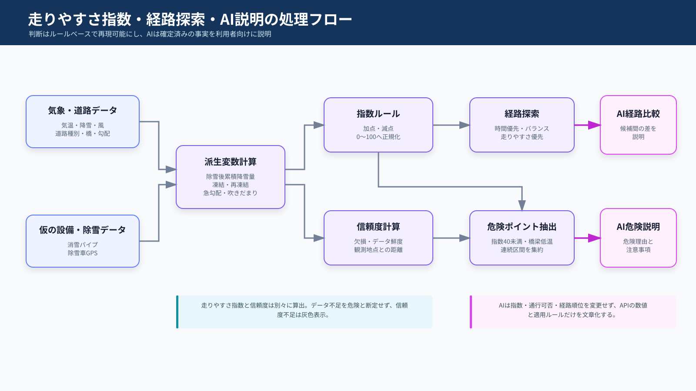
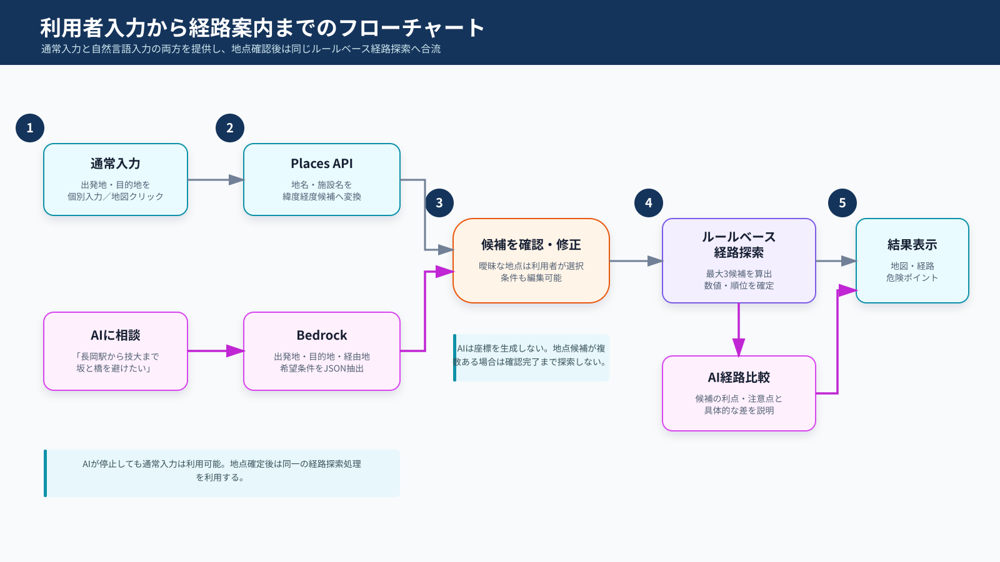
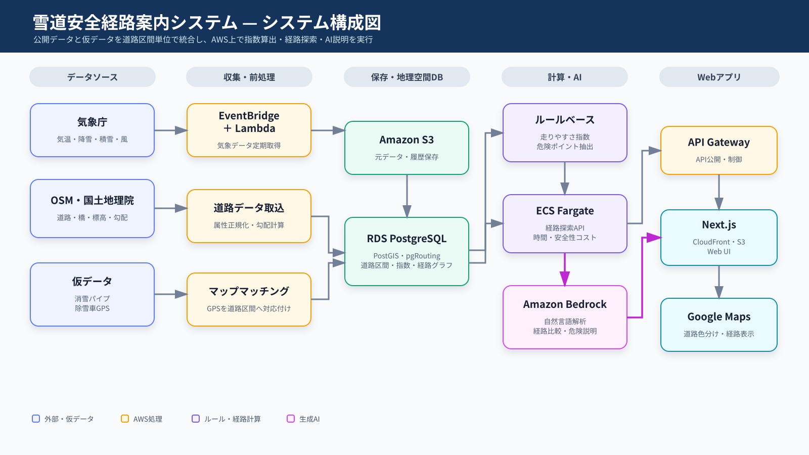

# 雪道走りやすさ可視化・安全経路案内Webアプリ 要件定義書

## 1. 文書情報

| 項目 | 内容 |
|---|---|
| 文書名 | 雪道走りやすさ可視化・安全経路案内Webアプリ 要件定義書 |
| システム名称 | 雪道安全経路案内システム（仮称） |
| 文書バージョン | 0.4 |
| 作成日 | 2026年7月11日 |
| 対象フェーズ | AWSハッカソン向けMVP |
| 対象地域 | 新潟県長岡市周辺を初期対象とする |

## 2. 背景

既存の一般的な地図・経路案内サービスは、所要時間、距離、有料道路、交通状況などを考慮して経路を提示する。一方、積雪地域において重要となる細かな降雪状況、道路勾配、消雪パイプの有無、除雪車の作業状況などを横断的に考慮し、雪道の走りやすさを優先した経路を提示する機能は限定的である。

本システムでは、公開されている気象・道路・標高等のデータと、実証用に作成する消雪パイプ・除雪車GPSの仮データを道路区間単位で統合する。これらからルールベースで「走りやすさ指数」を算出し、道路の色分け、安全性を考慮した経路案内、危険ポイントの説明をWebアプリとして提供する。

## 3. 目的

本システムの目的は以下のとおりである。

1. 道路区間ごとの雪道の走りやすさを、利用者が地図上で直感的に確認できるようにする。
2. 出発地と目的地に対して、所要時間だけでなく走りやすさを考慮した経路を提示する。
3. 推奨経路上の危険ポイントと、その判定根拠を分かりやすく説明する。
4. 将来、自治体等から実際の消雪パイプ・除雪車GPSデータが提供された場合に、仮データから置き換えられる構造とする。
5. 利用者が出発地・目的地・経路の希望を自然言語でも指定できるようにする。
6. 複数の候補経路について、時間と走りやすさの違いをAIが分かりやすく説明する。

## 4. 基本方針

- 走りやすさ指数は、機械学習ではなくルールベースで算出する。
- 指数計算に使用する実データは、利用条件を確認できる公開データに限定する。
- 消雪パイプと除雪車GPSは、本MVPでは仮データを使用する。
- Google Mapsは背景地図と表示に利用し、独自の走りやすさを考慮した経路探索はAWS側で実行する。
- 道路上の色分けは点のヒートマップではなく、道路区間ごとの色付きPolylineとして表示する。
- LLMは危険度の判定を行わず、ルールベースで抽出した事実を文章化する用途に限定する。
- 走りやすさ指数とデータ信頼度を分離し、データ不足を危険と断定しない。
- 本システムの情報は運転判断を補助する参考情報とし、安全を保証するものではない。

## 5. 対象範囲

### 5.1 MVPの対象

- 長岡市周辺の道路ネットワーク表示
- 公開気象データの定期取得
- 道路形状、道路属性、標高、勾配の取得・生成
- 消雪パイプ仮データの登録
- 除雪車GPS仮データの投入と道路区間への紐付け
- 道路区間ごとの走りやすさ指数算出
- 走りやすさに応じた道路の色分け
- 出発地・目的地による経路検索
- 通常フォームによる出発地・目的地入力
- 自然言語による出発地・目的地および経路条件入力
- AI抽出結果と地点候補の確認・修正
- 「時間優先」「バランス」「走りやすさ優先」の経路選択
- 候補経路間の違いを説明するAI
- 推奨経路上の危険ポイント表示
- Amazon Bedrockを用いた危険理由の文章生成

### 5.2 MVPの対象外

- 実際の自治体除雪車GPSとの接続
- 実際の消雪パイプ設備台帳・稼働状況との接続
- 路面温度センサーとの接続
- 道路カメラ画像の収集・画像認識
- VICS等の有償リアルタイム交通情報
- 凍結防止剤散布履歴
- 音声ナビゲーション
- ターンバイターン方式の車載ナビ
- ユーザー投稿・口コミ機能
- 走りやすさを予測する機械学習モデル
- 安全性または通行可能性の保証

## 6. 想定利用者

| 利用者 | 利用目的 |
|---|---|
| 一般ドライバー | 雪の少ない道路や走りやすい経路を確認する |
| 雪道に不慣れなドライバー | 危険区間と理由を事前に確認する |
| システム管理者 | データ更新状況、計算結果、障害を確認する |
| 実証担当者 | 仮データを投入し、指数や経路の変化を検証する |

## 7. 用語定義

| 用語 | 定義 |
|---|---|
| 道路区間 | 交差点間などで分割した経路探索上の最小単位 |
| 走りやすさ指数 | 道路区間の走りやすさを0～100で表す値。100が最も走りやすい |
| データ信頼度 | 指数算出に使用したデータの完全性と鮮度を0～1で表す値 |
| 危険ポイント | 走りやすさ指数が設定閾値を下回る区間、または特定の危険条件に該当する地点・区間 |
| マップマッチング | GPS座標を最も妥当な道路区間へ対応付ける処理 |
| 仮データ | 実データと同一または類似の形式で実証用に作成したデータ |
| 情報不明区間 | 必須データの欠損またはデータ鮮度不足により、十分な評価ができない区間 |

## 8. 利用データ要件

### 8.1 公開データ

| データ | 主な項目 | 取得元候補 | 取得・更新方法 | 用途 |
|---|---|---|---|---|
| 気象観測 | 気温、降水量、降雪量、積雪深、風速、風向 | 気象庁 | EventBridge Schedulerから定期取得 | 積雪・凍結・吹雪リスク算出 |
| 気象予報 | 予測気温、予測降雪・降水、注意報・警報 | 気象庁 | 公開XML等を定期取得 | 近未来の悪化傾向の反映 |
| 道路ネットワーク | 道路形状、道路種別、一方通行、橋梁、トンネル等 | OpenStreetMap | 初期取込および定期更新 | 表示・経路探索 |
| 標高 | 緯度経度ごとの標高 | 国土地理院標高タイル | 初期取込時に取得 | 道路勾配算出 |
| 通行規制・交通量 | 公開される規制、断面交通量等 | JARTIC、国土交通省、新潟県 | 利用条件と更新頻度を確認して取得 | 通行不可判定、参考情報 |

公開元の提供仕様、利用規約、出典表示条件、更新頻度を確認したうえで使用する。Web画面で閲覧できても、機械取得または二次利用条件が明示されていないデータは使用しない。

### 8.2 仮データ

#### 8.2.1 消雪パイプ

| 項目 | 型 | 必須 | 説明 |
|---|---|---:|---|
| segment_id | string | ○ | 対応する道路区間ID |
| snow_pipe | boolean | ○ | 消雪パイプの有無 |
| operation_status | string | ○ | active、inactive、unknown |
| effectiveness | number | ○ | 想定効果。0.0～1.0 |
| updated_at | datetime | ○ | データ更新日時 |

#### 8.2.2 除雪車GPS

| 項目 | 型 | 必須 | 説明 |
|---|---|---:|---|
| vehicle_id | string | ○ | 仮の車両識別子 |
| timestamp | datetime | ○ | 測位日時 |
| latitude | number | ○ | 緯度 |
| longitude | number | ○ | 経度 |
| speed_kmh | number | ○ | 走行速度 |
| operation | string | ○ | snow_removal、deicing、moving等 |

仮データであることを画面・発表資料・APIレスポンスのメタデータで明示する。

### 8.3 道路区間データ

各データは最終的に共通の`segment_id`へ紐付ける。

| 項目 | 内容 |
|---|---|
| segment_id | 道路区間の一意識別子 |
| source_node / target_node | 経路探索グラフ上の始点・終点 |
| geometry | 道路区間のLineString |
| length_m | 道路区間長 |
| road_type | 道路種別 |
| lanes | 車線数。不明の場合はNULL |
| speed_limit | 制限速度。不明の場合は道路種別の既定値 |
| bridge / tunnel | 橋梁・トンネルフラグ |
| elevation_start / elevation_end | 始点・終点標高 |
| max_gradient | 区間内最大勾配 |
| snow_pipe | 消雪パイプ有無 |
| last_plowed_at | 最終除雪日時 |
| drivability_score | 最新の走りやすさ指数 |
| confidence | 最新のデータ信頼度 |
| score_updated_at | 指数更新日時 |

## 9. 走りやすさ指数算出要件



図では、公開・仮データから派生変数と走りやすさ指数を計算し、ルールベースで経路と危険ポイントを確定した後、AIが候補経路の違いと危険理由を説明する流れを示す。

### 9.1 基本仕様

- 指数は道路区間ごとに0～100の整数で算出する。
- 100を最も走りやすい状態、0を通行回避相当とする。
- 初期値を100とし、該当するリスクに応じて減点し、設備効果に応じて加点する。
- 最終値は0～100の範囲に丸める。
- ルールの閾値と点数は設定ファイルまたは管理テーブルで変更可能とする。
- 同一要因の二重評価を避けるため、関連ルールの上限減点を設定可能とする。
- 通行止めが確認された区間は指数にかかわらず経路探索対象外とする。

### 9.2 使用変数

#### 静的変数

- 道路種別
- 車線数
- 制限速度
- 橋梁・トンネル
- 標高
- 最大勾配
- 消雪パイプの有無・稼働状態（仮データ）

#### 動的変数

- 現在気温
- 過去1時間・3時間の降雪量
- 現在の積雪深
- 今後1時間の予測降雪量
- 風速・風向
- 最終除雪時刻（仮データ）
- 過去3時間の除雪回数（仮データ）
- 通行規制

#### 派生変数

- 最終除雪からの経過時間
- 除雪後累積降雪量
- 凍結リスク
- 再凍結リスク
- 吹きだまりリスク
- 急勾配リスク
- データ鮮度

### 9.3 初期ルール案

以下はMVPの初期値であり、実証結果に基づき調整する。

| 条件 | 点数変化 |
|---|---:|
| 過去1時間降雪量が5cm以上 | -25 |
| 過去1時間降雪量が2cm以上5cm未満 | -15 |
| 過去1時間降雪量が0cm超2cm未満 | -5 |
| 除雪後累積降雪量が5cm以上 | -20 |
| 除雪後累積降雪量が2cm以上5cm未満 | -10 |
| 最終除雪から180分以上経過 | -15 |
| 最終除雪から60分以上180分未満 | -8 |
| 気温が-3℃以上1℃以下かつ降水・湿潤条件あり | -20 |
| 過去に0℃を上回り、現在0℃以下 | -15 |
| 今後1時間の予測降雪量が5cm以上 | -10 |
| 最大勾配が8%以上 | -20 |
| 最大勾配が5%以上8%未満 | -10 |
| 橋梁かつ気温2℃以下 | -15 |
| 風速10m/s以上 | -10 |
| 稼働中の消雪パイプあり | +15 |
| 直近60分以内に除雪済み | +10 |
| 通行止め | 経路探索対象外 |

### 9.4 データ信頼度

指数とは別に0.0～1.0の信頼度を算出する。

- 必須データが揃っている場合は1.0を基準とする。
- 気象データの観測地点から遠い場合は減点する。
- 最新取得時刻から時間が経過するほど減点する。
- 道路属性が欠損している場合は減点する。
- 仮データを含む場合は`is_simulated: true`を返す。
- 信頼度が設定閾値未満の道路は灰色で「情報不足」と表示する。
- 信頼度低下のみを理由に、走りやすさ指数を危険側へ変更しない。

### 9.5 危険ポイント抽出

- 経路上で走りやすさ指数が40未満の道路区間を危険区間候補とする。
- 橋梁かつ低温、最大勾配8%以上、通行規制あり等の重要ルールに該当する区間は、指数にかかわらず候補へ追加できるものとする。
- 連続する候補区間は一つの危険ポイント群としてまとめ、利用者への警告過多を防ぐ。
- 各危険ポイントには位置、対象区間、最低指数、適用ルール、入力データ、データ時刻を保持する。
- 危険ポイントの抽出はルール処理で行い、LLMには決定させない。

## 10. 経路探索要件

### 10.1 探索方式

道路ネットワークをグラフとしてPostgreSQL/PostGIS/pgRoutingで管理し、道路区間ごとのコストを用いて経路探索する。

基本コストは以下とする。

$$
route\_cost = expected\_travel\_time \times \left(1 + \alpha \times \frac{100 - drivability\_score}{100}\right)
$$

`alpha`は走りやすさを重視する度合いとし、モードごとに変更する。

| モード | alpha初期値 | 方針 |
|---|---:|---|
| 時間優先 | 0.2 | 所要時間を優先しつつ極端に危険な区間を抑制する |
| バランス | 1.0 | 所要時間と走りやすさを均衡させる |
| 走りやすさ優先 | 3.0 | 遠回りでも走りやすい区間を優先する |

### 10.2 経路探索制約

- 一方通行を考慮する。
- 通行止め区間を除外する。
- 道路ネットワーク外の出発地・目的地は最寄りの利用可能な道路へスナップする。
- 同一条件で可能な場合は代替経路を最大3件まで返す。
- 各経路について、距離、推定時間、平均指数、最低指数、危険区間数を返す。
- 使用した指数の基準時刻をAPIレスポンスへ含める。

## 11. 機能要件

| ID | 機能 | 要件 |
|---|---|---|
| FR-01 | 地図表示 | Google Mapsを背景として対象地域を表示できること |
| FR-02 | 道路色分け | 道路区間を走りやすさ指数に応じて色分けできること |
| FR-03 | 道路詳細 | 道路選択時に指数、信頼度、更新時刻、判定要因を表示できること |
| FR-04 | 通常地点入力 | 出発地と目的地を住所、施設名、地点候補または地図クリックで個別に指定できること |
| FR-05 | AI経路入力 | 一つの自然言語文から出発地、目的地、経由地、経路条件を抽出できること |
| FR-06 | 抽出結果確認 | AIが抽出した地点と条件を、探索前に利用者が確認・修正できること |
| FR-07 | 地点解決 | 抽出した地名・施設名を位置検索サービスで緯度経度候補へ変換できること |
| FR-08 | 経路探索 | 確定した地点間の独自経路を検索できること |
| FR-09 | モード選択 | 時間優先、バランス、走りやすさ優先を選択できること |
| FR-10 | 経路比較 | 距離、時間、平均指数、最低指数を比較できること |
| FR-11 | AI経路比較説明 | 候補経路の所要時間、走りやすさ、危険区間、利用者の希望との適合度をAIが比較説明できること |
| FR-12 | 危険ポイント | 推奨経路上の危険区間を地図上に表示できること |
| FR-13 | AI危険説明 | ルール判定結果から、危険要因と注意事項をAmazon Bedrockで自然文に変換できること |
| FR-14 | データ更新 | 公開データを定期取得し、指数を再計算できること |
| FR-15 | 仮データ投入 | 消雪パイプ・除雪車GPSの仮データを投入できること |
| FR-16 | 情報出典表示 | 公開データの出典、更新時刻、仮データ使用を表示できること |
| FR-17 | 障害時表示 | データ取得失敗や情報不足を利用者へ明示できること |

## 12. 画面要件

### 12.1 メイン地図画面

- Google Mapsを表示する。
- 「通常入力」と「AIに相談」の二つの入力方法を設置する。
- 通常入力では、出発地と目的地を別々の入力欄、地点候補または地図クリックで指定できるようにする。
- AI入力では、出発地、目的地、経由地、走行希望を一つの文章で入力できるようにする。
- AI入力欄に「長岡駅から長岡技術科学大学まで、坂道と橋をなるべく避けて行きたい」のような入力例を表示する。
- AI抽出後は、出発地、目的地、経由地、優先条件、許容遠回り時間を編集可能な項目として表示する。
- 地点候補が複数ある場合は、利用者が候補を選択するまで経路探索を実行しない。
- 経路モード選択を設置する。
- 走りやすさ指数の凡例を表示する。
- 道路区間を以下の色で表示する。

| 指数 | 色 | 表示名 |
|---:|---|---|
| 80～100 | 緑 | 走りやすい |
| 60～79 | 黄緑 | 比較的走りやすい |
| 40～59 | 黄 | 注意 |
| 20～39 | オレンジ | 走りにくい |
| 0～19 | 赤 | 危険度が高い |
| 信頼度不足 | 灰 | 情報不足 |

### 12.2 経路結果パネル

- 選択経路の距離と推定時間
- 平均走りやすさ指数
- 経路内の最低指数
- 危険区間数
- 主な危険要因
- データ基準時刻
- 実データ・仮データの区分
- 他の経路候補との比較
- AIによる候補経路の要約、利点、注意点、選択理由
- AI説明の根拠となった数値

### 12.3 道路区間詳細

- 道路区間名または区間ID
- 走りやすさ指数
- データ信頼度
- 気温、降雪量、積雪深
- 道路勾配、橋梁情報
- 消雪パイプ情報
- 最終除雪時刻
- 加点・減点の内訳
- 更新日時

## 13. LLM利用要件

- Amazon Bedrockを利用する。
- LLMの用途は「自然言語経路条件の抽出」と「危険・経路比較の文章化」に分ける。
- 危険理由・経路比較の生成では、ルールベースで確定した構造化データのみを根拠として与える。
- LLMに走りやすさ指数や通行可否を決定させない。
- 道路区間、指数、気象、勾配、除雪状況、判定ルールを入力する。
- 出力は「危険要因」「推奨される注意」「根拠」の形式とする。
- 入力にない事実、事故、規制、設備状態を生成しないようプロンプトで制約する。
- LLM呼び出し失敗時は、ルール名を用いた定型文へフォールバックする。
- 個人情報および除雪車を特定できる実在車両情報は送信しない。

### 13.1 自然言語経路条件の抽出

- 自然言語から出発地、目的地、経由地、優先方針、回避希望、許容遠回り時間、運転経験を抽出する。
- Amazon BedrockのStructured Outputs等を使用し、定義したJSON Schemaに従う結果を取得する。
- LLMに緯度経度を生成させない。抽出した地名・施設名はGoogle Places API等の位置検索サービスで解決する。
- 地点候補が複数ある場合、信頼度が低い場合、または出発地・目的地が不足する場合は利用者へ確認を求める。
- AIの抽出結果を利用者が修正してから経路探索を実行できるようにする。
- AI入力が利用できない場合でも、通常フォームから経路探索を利用できるようにする。
- 自然言語入力には文字数上限を設け、抽出結果をJSON Schemaと許可値一覧で検証する。
- 抽出結果から任意のAPIやデータベース操作を直接実行せず、地点確認とサーバー側検証を経て経路探索APIへ渡す。

抽出結果の例：

```json
{
  "origin_query": "長岡駅",
  "destination_query": "長岡技術科学大学",
  "via_queries": [],
  "priority": "safety",
  "avoid": ["steep_road", "bridge"],
  "prefer": ["main_road", "recently_plowed"],
  "max_detour_minutes": 10,
  "driver_experience": "beginner",
  "missing_fields": [],
  "needs_confirmation": true
}
```

### 13.2 AI入力処理フロー



通常入力とAI入力は、地点と条件の確定後に同一の経路探索処理を使用する。

### 13.3 候補経路比較AI

- 経路探索APIが返した最大3件の候補経路を比較する。
- 各経路の距離、所要時間、平均指数、最低指数、危険区間数、主要道路割合、急勾配区間、橋梁区間、除雪済み区間等を入力する。
- 自然言語入力から得た優先条件がある場合は、その条件との適合理由を説明する。
- 経路の数値、順位、通行可否をAIに再計算または変更させない。
- ルールベース経路探索が返した推奨順位を尊重し、AIは順位の根拠を説明する。
- 各経路について「概要」「利点」「注意点」を生成する。
- 「5分長いが最低指数が25高い」など、候補間の具体的な差を示す。
- 入力データにない道路状態、事故、規制等を生成しない。
- Structured Outputsを使用し、経路IDと説明の対応を保証する。

出力形式例：

```json
{
  "recommended_route_id": "route_b",
  "recommendation_reason": "経路Aより5分長い一方、最低指数が25高く、急勾配区間を回避できます。",
  "routes": [
    {
      "route_id": "route_a",
      "summary": "最短時間の経路です。",
      "advantages": ["所要時間が最短"],
      "cautions": ["最低指数が36", "急勾配区間を含む"]
    },
    {
      "route_id": "route_b",
      "summary": "走りやすさと時間のバランスがよい経路です。",
      "advantages": ["最低指数が61", "急勾配を回避"],
      "cautions": ["経路Aより5分長い"]
    }
  ]
}
```

### 13.4 危険ポイント・注意事項説明AI

- ルール処理で抽出済みの危険ポイントを入力とする。
- 各危険ポイントについて、場所、指数、適用ルール、気象値、道路属性、除雪状況、情報時刻を入力する。
- 「何が危険要因か」「なぜ注意が必要か」「どのような運転上の注意が必要か」を簡潔に説明する。
- 注意事項は一般的で安全側の表現とし、通行可能、安全、事故が起きない等を断定しない。
- 連続する危険区間は一つにまとめ、同じ注意の重複を避ける。
- 根拠データが不足する場合は推測せず「情報不足」と明示する。
- Structured Outputsを使用して危険ポイントID、説明、根拠、注意事項を対応付ける。
- Bedrock呼び出し失敗時は、適用ルールに対応する定型文を表示する。

出力例：

> この区間は気温が氷点付近で、直近1時間の降雪量が多く、最終除雪後にも降雪が続いています。急な操作を避け、速度を落として走行してください。

## 14. システム構成要件



公開データの収集、仮データの前処理、地理空間データベース、ルールベース計算、経路探索、生成AI、Webアプリの責務を分離する。

### 14.1 AWSサービス

| 用途 | AWSサービス |
|---|---|
| Web配信 | Amazon S3、Amazon CloudFront |
| API公開 | Amazon API Gateway |
| API・経路探索 | Amazon ECS Fargate |
| 定期データ取得 | AWS Lambda、Amazon EventBridge Scheduler |
| 元データ保存 | Amazon S3 |
| 地理空間DB | Amazon RDS for PostgreSQL、PostGIS、pgRouting |
| 自然言語解析・経路比較・危険説明 | Amazon Bedrock |
| シークレット管理 | AWS Secrets Manager |
| ログ・監視 | Amazon CloudWatch |
| DNS・証明書 | Amazon Route 53、AWS Certificate Manager |

## 15. API要件

| メソッド | パス例 | 用途 |
|---|---|---|
| GET | `/v1/road-segments` | 表示範囲内の道路区間と指数を取得 |
| GET | `/v1/road-segments/{id}` | 道路区間詳細を取得 |
| POST | `/v1/routes` | 出発地、目的地、モードから経路を探索 |
| POST | `/v1/ai/parse-route-request` | 自然言語から地点名と経路条件を抽出 |
| POST | `/v1/ai/explain-routes` | 確定済みの候補経路を比較説明 |
| POST | `/v1/ai/explain-danger-points` | 抽出済みの危険ポイントと注意事項を説明 |
| GET | `/v1/places/candidates` | 地名・施設名から地点候補を取得 |
| GET | `/v1/weather/status` | 気象データ更新状況を取得 |
| POST | `/v1/mock/plow-gps` | 除雪車GPS仮データを投入 |
| POST | `/v1/mock/snow-pipes` | 消雪パイプ仮データを投入 |
| POST | `/v1/admin/recalculate` | 指数の再計算を実行 |

GeoJSONを利用して道路形状および経路形状を返却する。APIレスポンスには`data_timestamp`、`confidence`、`is_simulated`を含める。

## 16. 非機能要件

### 16.1 性能

- 初回地図表示は通常の通信環境で5秒以内を目標とする。
- 道路色分けデータの取得は3秒以内を目標とする。
- 経路探索結果は5秒以内を目標とする。
- AI説明を含む最終結果は10秒以内を目標とし、生成中も数値と地図を先に表示する。
- 対象範囲外の道路データを一度に返さず、地図表示範囲またはタイル単位で取得する。

### 16.2 可用性・障害対応

- MVPの目標稼働率は95%以上とする。
- 外部データ取得失敗時は直前の正常データを利用する。
- 気象データが2時間以上更新されない場合は「情報が古い」と表示する。
- 利用可能なデータがない場合は推定せず「情報不足」と表示する。
- Bedrock障害時は定型文へフォールバックする。

### 16.3 セキュリティ

- 通信はHTTPSとする。
- Google Maps APIキー等は適切な参照元制限・API制限を設定する。
- 外部APIキーと認証情報はSecrets Manager等で管理する。
- 管理用APIは一般利用者から実行できないよう認証・認可を設定する。
- 入力値検証、レート制限、ログ監視を実施する。

### 16.4 保守性

- 指数ルールと重みをプログラム修正なしで変更可能とする。
- データ取得、前処理、指数算出、経路探索、LLM文章化を分離する。
- 各指数について加点・減点根拠を記録する。
- 外部データ取得処理には再試行と失敗ログを実装する。

### 16.5 出典・ライセンス

- OpenStreetMap等、出典表示が必要なデータは画面上に所定の帰属表示を行う。
- Google Maps Platformの利用規約に従う。
- 公開データごとに、取得元URL、ライセンス、取得日時、更新日時を管理する。
- 利用条件が明確でないWebデータのスクレイピングは行わない。

## 17. データ更新要件

| データ | 更新頻度の目安 |
|---|---|
| 気象観測 | 公開元の更新に合わせて10～60分ごと |
| 気象予報 | 1時間ごと、または発表更新時 |
| 走りやすさ指数 | 気象更新時および仮GPS受信時 |
| 道路ネットワーク | MVP開始時に取込。必要に応じて月次更新 |
| 標高・勾配 | 道路取込時に計算し、道路更新時に再計算 |
| 消雪パイプ仮データ | シナリオ投入時 |
| 除雪車GPS仮データ | デモでは5～30秒間隔を想定 |

## 18. ログ・監視要件

- 公開データ取得の成功・失敗
- 取得件数と対象時刻
- 指数計算の実行時刻、対象区間数、処理時間
- 経路探索の処理時間と成否
- Bedrockの入力解析、経路比較、危険説明ごとの成否と処理時間
- 仮データ投入履歴
- APIエラー率
- データ更新停止

これらをCloudWatch LogsおよびCloudWatch Metricsで確認可能とする。LLMへの入力・出力を保存する場合は、位置情報やログ保持期間を考慮する。

## 19. 受入条件

| ID | 受入条件 |
|---|---|
| AC-01 | 対象地域の道路ネットワークが地図上に表示されること |
| AC-02 | 公開気象データを取得し、取得時刻を確認できること |
| AC-03 | 全対象道路区間に指数または情報不足状態が設定されること |
| AC-04 | 指数に応じて道路が6区分で表示されること |
| AC-05 | 仮の消雪パイプ有無を変更すると対象区間の指数が変化すること |
| AC-06 | 仮の除雪車が通過すると対象区間の最終除雪時刻と指数が更新されること |
| AC-07 | 同一の出発地・目的地でもモード変更により経路が変化し得ること |
| AC-08 | 経路について距離、時間、平均指数、最低指数が表示されること |
| AC-09 | 危険区間と判定根拠が表示されること |
| AC-10 | Bedrockが利用できない場合にも定型文で危険理由が表示されること |
| AC-11 | 仮データ使用と公開データ出典が画面上で確認できること |
| AC-12 | データが古い場合または不足する場合に、その状態が明示されること |
| AC-13 | 通常フォームから出発地・目的地を指定して経路探索できること |
| AC-14 | 自然言語から出発地・目的地・経路条件が所定のJSON形式で抽出されること |
| AC-15 | 曖昧な地点が複数候補として表示され、利用者が選択できること |
| AC-16 | AI抽出結果を修正してから経路探索できること |
| AC-17 | AI入力が利用できない場合でも通常入力が利用できること |
| AC-18 | AI経路比較が候補経路の所要時間、平均指数、最低指数の差を正しく説明すること |
| AC-19 | AI経路比較が経路ID、数値、推奨順位を変更しないこと |
| AC-20 | 危険ポイント説明が適用ルールと入力データに基づき、未入力の事実を追加しないこと |
| AC-21 | AI説明が失敗した場合に定型文へフォールバックすること |

## 20. テスト要件

### 20.1 ルール単体テスト

- 各閾値の境界値で期待した加点・減点になること。
- 複数ルールが同時に成立した場合に正しく合算されること。
- 指数が0未満または100を超えないこと。
- 通行止めが経路から除外されること。
- 欠損データが信頼度へ反映されること。

### 20.2 シナリオテスト

1. 降雪なし・除雪直後・消雪パイプあり
2. 強い降雪・除雪なし・急勾配
3. 気温上昇後に氷点下となる再凍結条件
4. 橋梁・低温・降雪あり
5. 気象データ更新停止
6. 仮GPSの道路外測位
7. 通行止めにより迂回が必要
8. Bedrock呼び出し失敗
9. 自然言語に出発地または目的地が含まれない
10. 同名施設が複数存在する
11. AIが抽出した条件を利用者が修正する
12. 所要時間と最低指数がトレードオフとなる3経路をAIが比較する
13. 危険ポイントが連続する場合に説明を集約する
14. AI入力に存在しない事故・規制等を回答しないことを確認する

## 21. 制約・リスク

- アメダス等は地点観測であり、道路ごとの実際の気象・路面状態を直接表すものではない。
- 仮の消雪パイプ・除雪車GPSは、システム動作を示すためのものであり、現実の道路状況を表さない。
- 路面温度を使用しないため、凍結判定には不確実性がある。
- OpenStreetMapの道路属性には欠損や誤差が含まれる可能性がある。
- 公開データの配信停止、仕様変更、更新遅延が発生する可能性がある。
- ルールと点数は初期仮説であり、実走行や路面観測による妥当性検証が必要である。
- Google Mapsの標準経路と本システムの独自経路は一致しない場合がある。
- LLMの文章は補足説明であり、指数の正当性を保証するものではない。

## 22. 今後の拡張

- 長岡市から提供を受けた消雪パイプデータへの置換
- 実際の除雪車GPSへの置換
- 路面温度・路面状態センサーとの連携
- 道路カメラ画像による路面状態分類
- プローブ車両の速度・急減速・スリップ情報の利用
- 利用者の走行後評価によるルール校正
- ルールベースと機械学習を組み合わせた予測
- 30分後・1時間後の走りやすさ予測
- 利用者の雪道経験や車両種別に応じた経路設定
- 自治体向け除雪状況ダッシュボード

## 23. 参考データ提供元

- [気象庁 気象データ高度利用ポータル](https://www.data.jma.go.jp/developer/index.html)
- [気象庁 防災情報XML](https://xml.kishou.go.jp/)
- [国土地理院 標高タイル仕様](https://maps.gsi.go.jp/development/demtile.html)
- [国土交通省 国土数値情報](https://nlftp.mlit.go.jp/ksj/)
- [長岡市 オープンデータ](https://www.city.nagaoka.niigata.jp/shisei/cate10/)
- [JARTIC オープンデータ](https://www.jartic.or.jp/service/opendata/)
- [新潟県 土木防災情報](https://www.pref.niigata.lg.jp/sec/dobokukanri/1245960070520.html)
- [OpenStreetMap](https://www.openstreetmap.org/)

---

本書の指数ルール、閾値、対象範囲および更新頻度はMVP向けの初期定義であり、実証結果と公開データの提供条件を踏まえて更新する。
